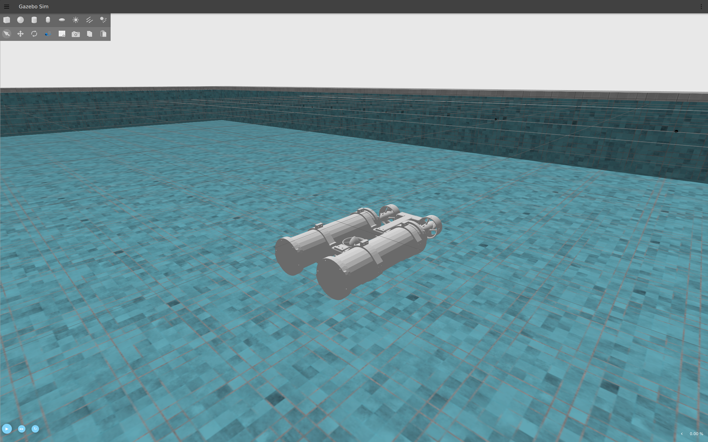

# Nautilus One AUV

> Status: created working gazebol models of the AUV and competition accurate pool world.

> Rulebook Edition :book:: [Rulebook 5.1.4](http://web.archive.org/web/20241231081446/https://sauvc.org/rulebook/)

Contains collection of [ROS2](https://www.ros.org/) packages that provide AUV functionality targeted 
towards the SAUVC 2025 competition for **Nautilus One**.

Nautilus One uses [ArduSub](http://www.ardusub.com/) as the flight controller and
[mavros](https://github.com/mavlink/mavros) as the GCS.



Nautilus One runs in [Gazebo Garden](https://gazebosim.org/docs/garden/getstarted/) using the standard buoyancy, 
hydrodynamics and thruster
plugins. The connection between ArduSub and Gazebo is provided by [ardupilot_gazebo](https://github.com/ArduPilot/ardupilot_gazebo).

## Pre-requisites

Check out the [installation file](INSTALL.md).
  
The project assumes that you are using `zsh` like a sane human.


## Usage

### Manual Control with the real robot
Launch MAVProxy when the robot is connected via ethernet.
```bash
mavproxy.py --master=udp:0.0.0.0:14550 --out=udp:0.0.0.0:14660
```

### Manual Control in Sim
To launch the simulation environment:

```bash
ros2 launch auv_bringup sim_launch.py world:=pool mavros:=False
```

Launch MAVProxy in a 2nd Terminal:
```bash
mavproxy.py --master tcp:127.0.0.1:5760 --sitl 127.0.0.1:5501 --out 127.0.0.1:14550 --out 127.0.0.1:14551 --out udp:0.0.0.0:14550 --console
```
You can use MAVProxy to send commands directly to ArduSub:

```
arm throttle
rc 3 1450
rc 3 1500
mode alt_hold
disarm
```

RC channels:
* RC 3 -- vertical
* RC 4 -- yaw
* RC 5 -- forward

### Autonomously move the AUV for 10s
To launch the simulation environment:

```bash
ros2 launch auv_bringup sim_launch.py world:=pool
```

Launch the forward executable in a 2nd Terminal:
```bash
ros2 run auv_autonomy forward
```

###
To launch the cameras connected to jetson

```bash
ros2 launch usb_cam cameras.launch.py
```

To check camera feed

```bash
rviz2
```
and add image and choose the correct topic.  


## Debug
1. If things don't work, make sure that all the required environment variables are set as given above. Make sure to `zsh`.
2. Please ensure that you do all of the initialization steps one after the another. Otherwise, things may not work.

## Packages

* [`auv_autonomy` Basic autonomous functions](auv_autonomy)
* [`auv_bringup` Launch files](auv_bringup)
* [`auv_description` SDF files](auv_description)
* [`auv_ml` Inference Node](auv_ml)
* [`auv_interfaces` Interfaces](auv_interfaces)
* [`auv_sensing` Camera Nodes](auv_sensing)
