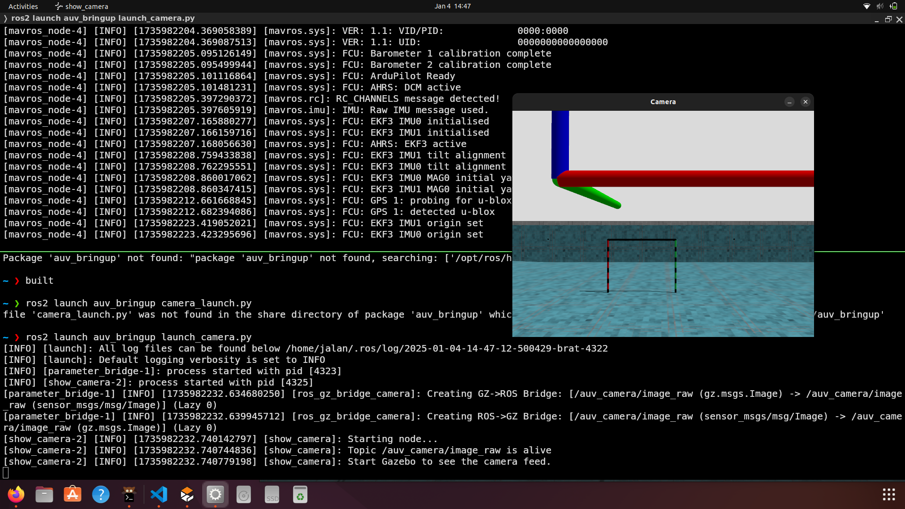
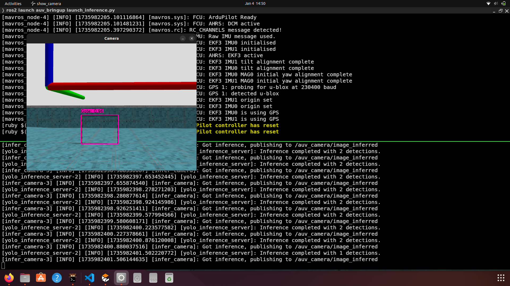

## Usage

Build the packages as before. Then, launch gazebo using the following command:

```bash
ros2 launch auv_bringup sim_launch.py world:=pool` 
```

To launch just the camera view.
```bash
ros2 launch auv_bringup launch_camera.py
```



To launch inference with camera view.
```bash
ros2 launch auv_bringup launch_inference.py
```



Currently, the camera is set to a very low FPS to allow synchronous inference.

